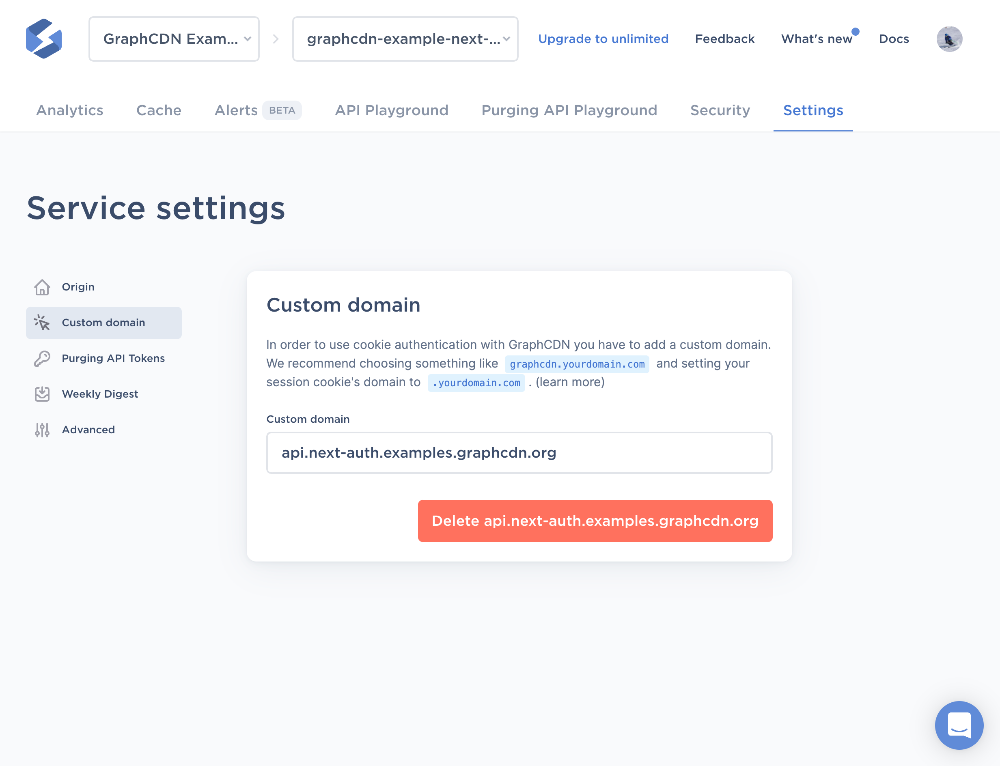

# Authentication with `next-auth`

This example shows how to use GraphCDN with a GraphQL API that does cookie-
based authentication using the [`next-auth`](https://next-auth.js.org/)
library for Next.js apps.

The example app contains:

- One page that shows a login form or a logout button, depending on the
  authorization state.
- One API route that runs the GraphQL API.

For the sake of example there's no validation of credentials, i.e. the login
works with all credentials.

You can see a demo of this project at https://next-auth.examples.graphcdn.org/

## Setup this project

1. Clone the repository
2. Install the dependencies using `yarn`
3. Create a Vercel project by running `yarn deploy` and answering the prompts
4. Add a custom domain (e.g. `your.custom.domain`) to the project in Vercel
   (see the [Vercel docs](https://vercel.com/docs/concepts/projects/custom-domains)
   on how to do that)
5. Create a GraphCDN service for the GraphQL API at `https://your.custom.domain/api/graphql`,
   the name of the session cookie for authenticated users is `__Secure-next-auth.session-token`
6. Assign the custom domain `graphcdn.your.custom.domain` to the new service
7. Add [environment variables](https://vercel.com/docs/concepts/projects/environment-variables)
   to your Vercel project (the ones from `.env.example`):
   - `SESSION_SECRET`: Any random string to use as secret for your session
     cookies
   - `NEXT_PUBLIC_API_ENDPOINT`: The endpoint for your API, which now is
     `https://graphcdn.your.custom.domain`
   - `NEXTAUTH_URL`: The custom domain you assigned to your Vercel project,
     i.e. `your.custom.domain`
8. Create a new production deployment for the new environment variables to take
   effect by running `yarn deploy --prod`

You can also run this project locally like any other Next.js app. You only need
to copy the `.env.example` file into `.env.local`.

## Cookie-based authentication with GraphCDN

Using a GraphQL API that performs cookie-based authentication with GraphCDN
requires an extra step: You need to set up a custom domain on GraphCDN.

The reason for that is just how cookies over HTTP work. When sending a request
to log in, the response usually contains a `Set-Cookie` header that stores some
kind of token inside a cookie. However, the browser will by default not accept
this cookie for a "cross-origin request", i.e. a request that was sent to a
different domain.

GraphCDN gives you a subdomain where you can access your service out of the
box at `<service-name>.graphcdn.app`, but this is a different domain than your
website.

To solve this, GraphCDN allows you to set a custom domain in the settings for
your service. After adding the domain, you'll see a message that tells you how
to modify your domains DNS settings.

